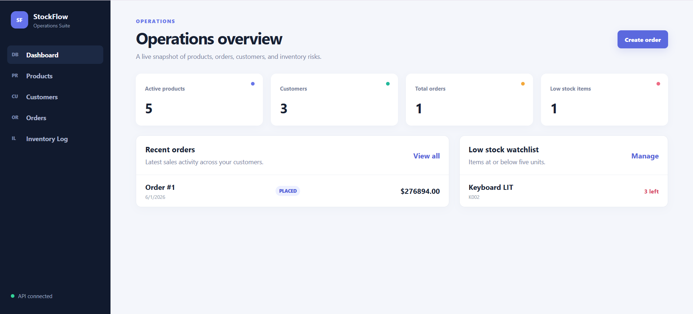
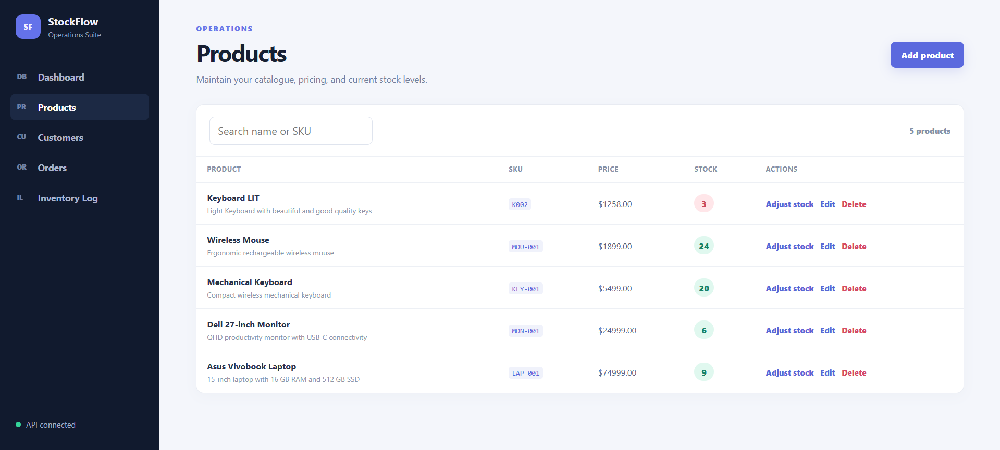
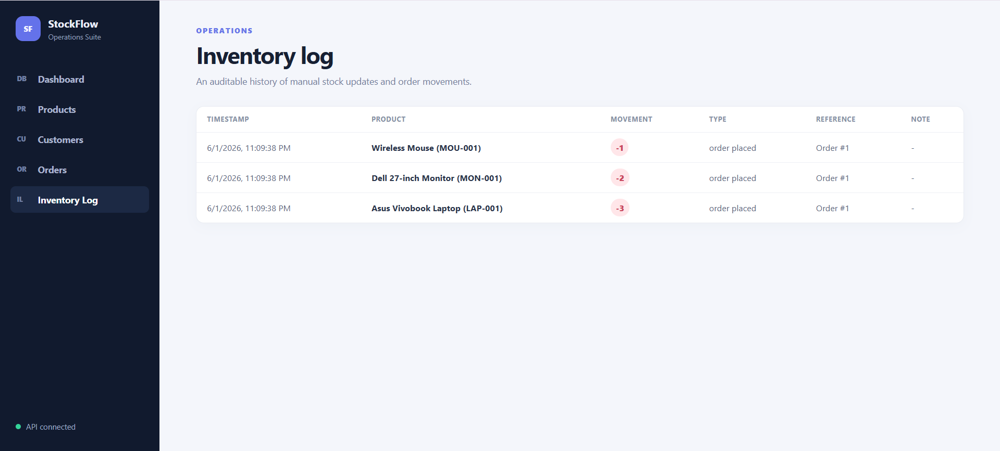

# StockFlow – Inventory & Order Management System

<p align="center">
  <b>Full Stack Inventory & Order Management Platform</b><br/>
  Built with FastAPI, React, PostgreSQL, Docker & Modern DevOps Practices
</p>

---

## Live Demo

### Frontend

🔗 https://inventory-order-management-zeta.vercel.app/

### API Documentation

🔗 https://inventory-order-management-fvs6.onrender.com/docs

### Docker Image

🔗 https://hub.docker.com/r/63982355/inventory-order-api

---

## Overview

StockFlow is a modern inventory and order management system designed for businesses to manage products, customers, orders, and inventory transactions efficiently.

The platform ensures inventory consistency using transactional database operations and provides a clean operational dashboard for tracking stock movement and order activity.

---

## Features

### Product Management

* Create, update and delete products
* SKU-based inventory tracking
* Real-time stock management
* Low-stock monitoring

### Customer Management

* Customer CRUD operations
* Unique email validation
* Customer order history support

### Order Processing

* Multi-item order creation
* Automatic order total calculation
* Order status management
* Order cancellation support

### Inventory Tracking

* Inventory audit logs
* Automatic stock deduction
* Stock restoration on cancellation
* Inventory movement history

### Developer Features

* FastAPI Swagger Documentation
* Alembic Migrations
* Dockerized Development Setup
* Automated Testing
* CI/CD Ready Architecture

---

## Tech Stack

### Backend

* FastAPI
* SQLAlchemy
* PostgreSQL
* Alembic
* Pydantic
* Pytest

### Frontend

* React
* TypeScript
* Vite

### DevOps & Deployment

* Docker
* Docker Compose
* GitHub Actions
* Neon PostgreSQL
* Render
* Vercel

---

## Project Structure

```text
inventory-order-management/
│
├── backend/
│   ├── alembic/
│   ├── app/
│   │   ├── api/
│   │   ├── models/
│   │   ├── schemas/
│   │   ├── services/
│   │   └── core/
│   ├── tests/
│   └── scripts/
│
├── frontend/
│   └── src/
│       ├── components/
│       ├── pages/
│       ├── api/
│       └── types/
│
├── docker-compose.yml
├── render.yaml
└── .env.example
```

---

##  System Architecture

```text
Customers
    │
    ▼
 Orders
    │
    ▼
Order Items
    │
    ▼
 Products
    │
    ▼
Inventory Transactions
```

---

##  Local Setup

### Clone Repository

```bash
git clone https://github.com/AbhayRastogi11/inventory-order-management.git

cd inventory-order-management
```

### Configure Environment Variables

```bash
cp .env.example .env
```

### Start Application

```bash
docker compose up --build
```

### Seed Demo Data

```bash
docker compose exec backend python -m scripts.seed
```

---

##  Local URLs

| Service      | URL                          |
| ------------ | ---------------------------- |
| Frontend     | http://localhost:5173        |
| Backend      | http://localhost:8000        |
| API Docs     | http://localhost:8000/docs   |
| Health Check | http://localhost:8000/health |

---

## Run Tests

```bash
docker compose run --rm backend pytest
```

---

## Inventory Consistency

Order placement is handled inside a single PostgreSQL transaction.

The backend uses:

* Row-level locking (`SELECT FOR UPDATE`)
* Atomic stock updates
* Transaction rollback on failure
* Inventory audit logging

This prevents:

* Overselling
* Race conditions
* Inventory corruption
* Concurrent stock conflicts

---

##  Application Screenshots

### Dashboard



### Products



### Inventory Log



---

## 🐳 Docker Image

Pull the latest backend image:

```bash
docker pull 63982355/inventory-order-api
```

---

## Deployment

### Frontend

Hosted on Vercel

### Backend

Hosted on Render

### Database

Hosted on Neon PostgreSQL

---

## Author

### Abhay Rastogi

GitHub:
https://github.com/AbhayRastogi11

